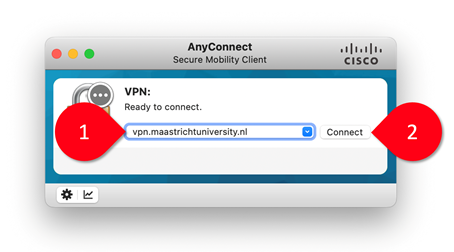
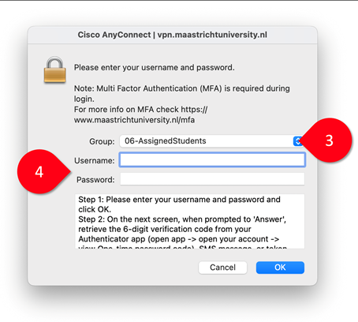
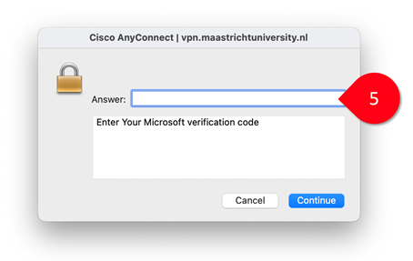

# **Getting started with UM VPN**

The UM VPN (Virtual Private Network) allows you to log in to the university network from anywhere, which also means that it gives you access to resources that are only available to UM users. In *Machines of Knowledge*, you will need to VPN to view paywalled e-books and e-journals from the library when working at home, and you will also need it to access research databases licensed by Maastricht University.

Theoretically, VPN is also key to accessing the university's programming resources such as the DSRI (Data Science Research Infrastructure). In previous years, we used DSRI to run code for data scraping, but this component of the course is now voluntary, and we will run everything directly in your browser via Live Code. 

The DSRI itself hasn't disappeared — it's still used for staff-led research projects with heavier computing needs. So you may have used it with Thom for running R-studio in the pre-MA, and you may use it in the future when opting for a coding-oriented internship within UM; but for this course, you can set DSRI aside and focus on setting up VPN instead.

## Download and install the client

On MacOS and Windows, you need to download and install the Maastricht University VPN client from [vpn.maastrichtuniversity.nl](http://vpn.maastrichtuniversity.nl).

**Figure 1:** Using the Cisco AnyConnect client to connect to vpn.maastrichtuniversity.nl.

## Launch the UM VPN client
- Open the *Cisco AnyConnect Secure Mobility Client*.
- Specify the server `vpn.maastrichtuniversity.nl` (1) and click *Connect* (2).
- Select the group *06-AssignedStudents* (3), enter your username (I-number) and password (4), and press *OK*.

**Figure 2:** Entering your UM username and password in the Cisco AnyConnect client.

- Enter your one-time passcode (5).

**Figure 3:** Entering your verification code in the Cisco AnyConnect client.

🙌 These instructions were provided by Arnoud Wils (The Plant, FASoS) in 2025.
